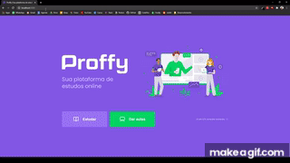

# Proffy | Plataforma de estudos online

## Sobre

Versão web da Proffy, uma plataforma estruturada para conectar professores(as) a estudantes que buscam aulas particulares ou reforço escolar. O(a) profissional cadastra suas disciplinas, uma breve biografia, disponibilidade de tempo e contato. Para o(a) estudante, a plataforma permite filtragem por matéria, dia da semana e hora, retornando os(as) professores(as) disponíveis.

O projeto foi desenvolvido ao longo da da segunda edição da [Next Level Week](https://nextlevelweek.com/), ocorrida entre 3 e 9 de agosto de 2020. A imersão é uma iniciativa da [Rocketseat](https://rocketseat.com.br/) e a construção do projeto foi guiada por [Mayk Brito](https://github.com/maykbrito) na trilha Discovery, pensada para iniciantes em desenvolvimento.

## Tecnologias utilizadas

- HTML5
- CSS3
- JavaScript
- Nodejs.
- Nunjucks
- SQLite

## Detalhes

### Projeto pensado sob o conceito _mobile first_


### Front-end e back-end construídos passo a passo do zero



Para conferir uma demo da aplicação rodando, **[clique aqui!](https://youtu.be/x2WQM1EMKt4)**

## Como executar

No terminal:

```bash
# Clonar repositório
git clone https://github.com/mrnxisto/proffy-web.git

# Entrar no diretório
cd proffy-discovery

# Baixar dependências
npm i

# Executar o servidor
npm run dev
```

Abra o navegador e acesse `http://localhost:5500/`
